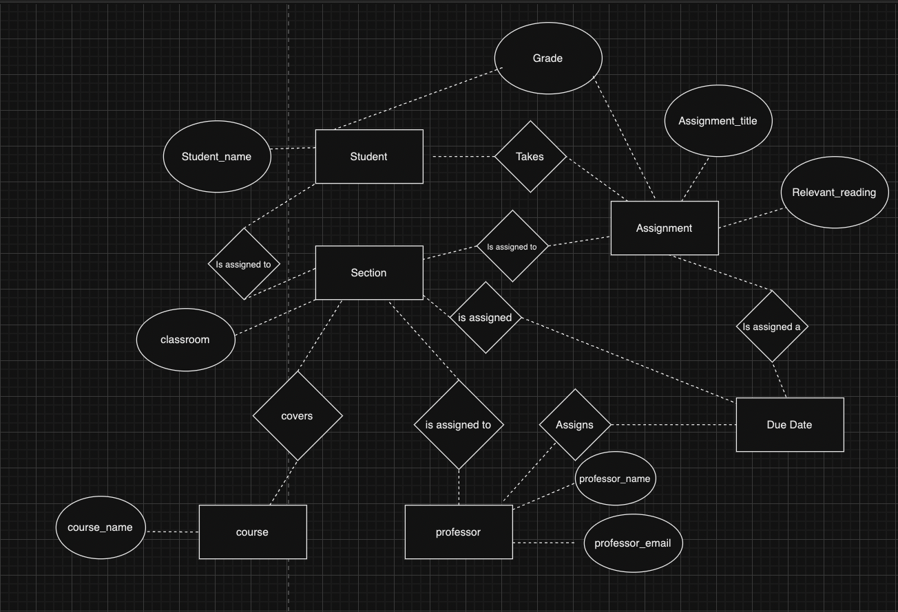

# Data Normalization and ER Diagram Assignment

## Original Data

| assignment_id | student_id | due_date | professor | assignment_topic                | classroom | grade | relevant_reading    | professor_email   |
| :------------ | :--------- | :------- | :-------- | :------------------------------ | :-------- | :---- | :------------------ | :---------------- |
| 1             | 1          | 23.02.21 | Melvin    | Data normalization              | WWH 101   | 80    | Deumlich Chapter 3  | l.melvin@foo.edu  |
| 2             | 7          | 18.11.21 | Logston   | Single table queries            | 60FA 314  | 25    | Dümmlers Chapter 11 | e.logston@foo.edu |
| 1             | 4          | 23.02.21 | Melvin    | Data normalization              | WWH 101   | 75    | Deumlich Chapter 3  | l.melvin@foo.edu  |
| 5             | 2          | 05.05.21 | Logston   | Python and pandas               | 60FA 314  | 92    | Dümmlers Chapter 14 | e.logston@foo.edu |
| 4             | 2          | 04.07.21 | Nevarez   | Spreadsheet aggregate functions | WWH 201   | 65    | Zehnder Page 87     | i.nevarez@foo.edu |
| ...           | ...        | ...      | ...       | ...                             | ...       | ...   | ...                 | ...               |

This data is non-compliant with second, third, and fourth normal forms.

It is non-compliant with second normal form as the non-key fields professor_email, professor, and classroom do not tell us anything about the student or assignment, meaning the table does not provide a fact about the entity uniquely identified by the primary key.

It is non-compliant with third normal form as the non-key fields professor_email and classroom are about the professor, meaning a non-key field is a fact about another non-key field.

It is non-compliant with fourth normal form as due_date, professor, assignment_topic, classroom, grade, relevant_reading, and professor_email are all independent multi-valued facts about an entity, and a 4NF compliant table can only have 1.

## Making the table compliant with 4NF

### Grades Table

| id | student_id | assignment_id | section_id | grade |
| :------- | :------- | :------- | :-------- | :--------- | :-------- |
| 1 | 1         | 1          | 1 | 80    |
| 2 | 7             | 2          | 2 | 25    |
| 3 | 4             | 1          | 1 | 75    |
| 4 | 2            | 5          | 2 | 92    |
| 5 | 2             | 4          | 3 | 65    |

The Grades table is represented by a surrogate_id as its primary key. The student_id, assignment_id, and section_id are all parts of the data set that further explain what grade this is for, followed by the grade.

### Assignments Table

| assignment_id | assignment_topic | relevant_reading |
| :------- | :------------------------------ | :------------------ |
| 1 | Data normalization              | 1          | Deumlich Chapter 3  |
| 2 | Single table queries            | 2          | Dümmlers Chapter 11 |
| 4 | Python and pandas               | 1          | Dümmlers Chapter 14 |
| 5 | Spreadsheet aggregate functions | 2          | Zehnder Page 87     |

The assignments table has been stripped down to merely contain the assignment topic and relevant reading columns, as they were the only tables in the original table that directly provide information on the assignment and not the grade.

### Professors Table

| professor_id |  professor_name | professor_email |
| :------- | :-------- | :---------------- |
| 1 | Melvin    | l.melvin@foo.edu  |
| 2 | Logston   | e.logston@foo.edu |
| 3 | Nevarez   | i.nevarez@foo.edu |

I took the columns in the original table in the data set that gave details on the professor and put them into a separate table with a primary key.

### Section Table

| section_id | course_id | classroom | professor_id |
| :---- | :---- | :---- | :-------- |
| 1 | 1         | WWH 101   | 1 |
| 2 | 2         | 60FA 314  | 2 |
| 3 | 3         | WWH 201   | 3 |

I created a new field called section to detail the section which the students take and professor teaches of the course. Course_id, classroom, and professor_id are all fields that better describe the section.

### Course Table

| course_id | course_name |
| :---- | :------------------------------ |
| 1         | Database Design   |
| 2         | Database Mangement  |
| 3         | Financial Modeling   |

The course_id and course_name are here to satisfy 2NF and prevent redundant information.

### Due Date Table

| id | assignment_id | section_id | due_date |
| :---- |:------- | :----- | :------- |
| 1 | 1 | 1 | 1          | 23.02.21 |
| 2 | 2 | 2 | 2          | 18.11.21 |
| 3 | 4 | 2 | 1          | 05.05.21 |
| 4 | 5 | 3 | 2          | 04.07.21 |

The due date table takes a surrogate_id, the assignment_id and section_id and assigns a due date. 

### Student Table

| student_id | student_name |
| :---- | :------------------------------ |
| 1         | John Smith   |
| 7         | Jane Doe  |
| 4         | Brendan Smith   |
| 3         | Dave Rodgers   |

The student_id and student_name are here to satisfy 2NF and prevent redundant information.

## Entity Relationship Diagram

